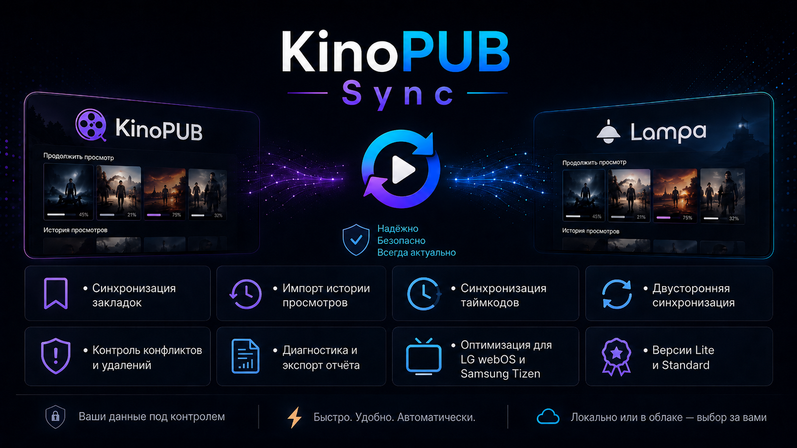
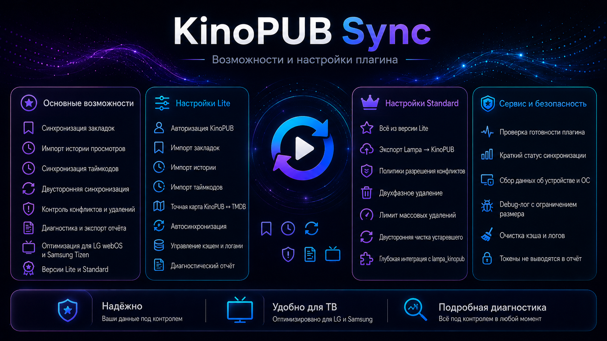

# Lampa KinoPUB Sync v0.5.11 lite

TV bundle-плагин синхронизации KinoPUB ↔ Lampa.





## Что изменилось в v0.5.11

- Внутри единственного компонента настроек **KinoPUB Sync Lite** добавлены визуальные разделители-подкатегории.
- Компонент остаётся один: `Настройки → KinoPUB Sync Lite`.
- Разделители реализованы через безопасный параметр `type: 'title'`, у каждого есть `values: ''` и описание, чтобы не повторить ошибку с падением Settings UI.
- Добавлен небольшой CSS для строк `kp_sync_sep_*`: заголовки выглядят как разделы и не показывают значение справа.
- Действия вроде запуска синхронизации, проверки готовности, копирования отчёта и очистки теперь зарегистрированы как `button`, а не как переключатели.


## Security patch v0.5.11

- Любые удаления в silent/autosync режиме запрещены по умолчанию.
- В Standard добавлена настройка **Разрешить удаления при автосинхронизации**; по умолчанию выключена.
- Debug-лог, диагностический отчёт и console-log проходят через маскирование секретов (`Bearer`, `access_token`, `refresh_token`, `kp_token`, `kp_refresh`, query-параметры).
- Диагностический отчёт по умолчанию скрывает полный `userAgent` и URL с query-параметрами.
- Низкоуровневый `KinoPubSyncCore` скрыт в обычном режиме; он доступен только при включённом debug-log и после перезапуска Lampa.
- В отчёт добавлена контрольная сумма сборки `buildChecksum`; рядом лежит файл `docs/kp-sync.js.sha256`.
- При включении глубокого bridge или удалений показывается предупреждение.

## Подкатегории настроек

- **Основное** — ручной запуск, авторизация, выход.
- **Импорт KinoPUB → Lampa** — закладки, история, таймкоды, папки KinoPUB.
- **Сопоставление и точность** — TMDB lookup, identity-map, строгий режим.
- **Автосинхронизация** — интервал, лимит API, пауза между запросами.
- **Кэш, логи и диагностика** — автоочистка, debug-лог, сведения устройства.
- **Действия и обслуживание** — очистка карт/кэша/логов, health-check, диагностический отчёт.

## Установка

Если оригинальный `lampa_kinopub` уже установлен отдельно, добавляйте:

```text
https://<your-domain>/.../docs/kp-sync.js?v=0511
```

Если нужен загрузчик, который сначала подключит оригинальный `lampa_kinopub`, а затем KinoPUB Sync:

```text
https://<your-domain>/.../docs/kp.js?v=0511
```

## Диагностика

В настройках KinoPUB Sync есть пункт:

```text
Скопировать диагностический отчёт
```

Также отчёт можно получить из консоли:

```js
KinoPubSync.diagnosticReport()
KinoPubSync.copyDiagnosticReport()
KinoPubSync.collectDiagnostics()
KinoPubSync.deviceInfo()
KinoPubSync.deviceSummary()
```

Токены KinoPUB в отчёт не включаются. Отчёт может содержать названия просмотренных фильмов/сериалов в debug-логе или последнем статусе, если подробный debug-лог был включён.

## Настройки памяти

- Автоочистка служебного кэша — включена по умолчанию.
- Максимальный размер кэша — Lite: 300 KB, Standard: 500 KB.
- Удалять кэш старше — 90 дней.
- Сохранять debug-лог — выключено по умолчанию.
- Лимит строк debug-лога — 50 при включённом debug-log.

## Состав сборки

Для работы на ТВ нужны только:

```text
docs/kp-sync.js
docs/kp.js
```

Папка `modules/` не используется: всё собрано в один `kp-sync.js`, чтобы снизить риск 404/CORS/кеша отдельных модулей.
